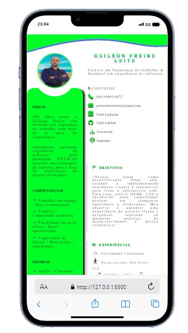
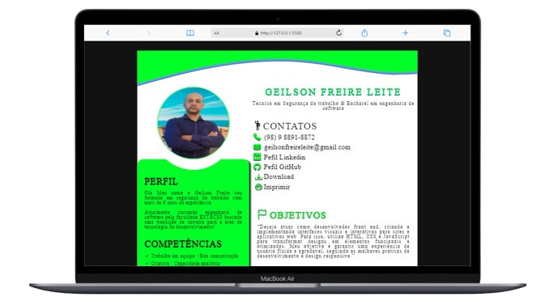

## Deploy: https://geilsonfreire.github.io/my_cv_vitae/

# CURRICULUN VITAE

O projeto foi finalizado com sucesso, alcançando todos os objetivos estabelecidos. Utilizamos uma combinação de tecnologias web modernas, incluindo HTML, CSS e JavaScript, juntamente com a biblioteca Bootstrap para garantir um design responsivo e uma experiência de usuário aprimorada.

# TECNOLOGIAS

#Resumo
No que diz respeito ao HTML, foi utilizado para estruturar semanticamente o conteúdo da página, garantindo uma base sólida para a acessibilidade e indexação pelos mecanismos de busca.

O CSS foi empregado para estilizar os elementos da página, garantindo uma apresentação visual atraente e consistente em diferentes dispositivos e tamanhos de tela. Além disso, técnicas avançadas de CSS foram aplicadas para criar animações e transições que tornaram a experiência do usuário mais dinâmica.

O JavaScript desempenhou um papel crucial na interatividade da página, permitindo a implementação de funcionalidades como validação de formulários, interação com elementos da interface do usuário e manipulação de dados em tempo real.

A biblioteca Bootstrap foi integrada ao projeto para aproveitar seus componentes predefinidos e seu sistema de grid responsivo, agilizando o desenvolvimento e garantindo uma aparência moderna e profissional para o site.

No geral, a finalização do projeto foi bem-sucedida, resultando em uma aplicação web funcional, esteticamente agradável e totalmente responsivo! 
